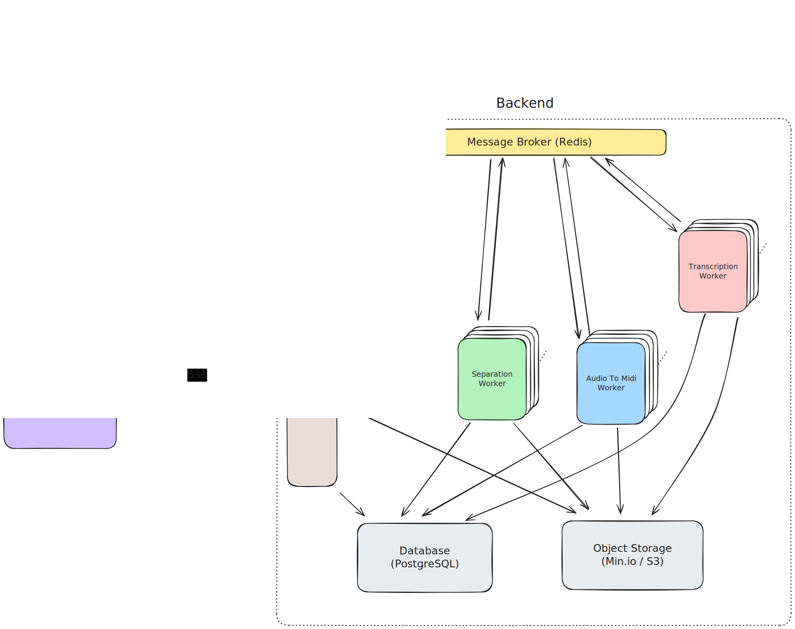

# NeuraLib - Intelligent Sample Management and Processing

## What is it?

- NeuraLib is a distributed sample management and processing platform
- Leverages multiple state-of-the-art neural networks for audio processing
  - Source Separation (extract vocals, bass, drums and other using Demucs)
  - Vocal Transcription (using OpenAI Whisper)
  - Audio to Midi conversion (convert audio to midi, for further use in your DAW )
- Enables audio file library management (import/export your audio files and libraries)
- Streamed playback (stream large audio files without needing to download the whole file)
- Sample slicing (heard a sick snare in a track? separate the song and slice the drum loop to get it easily)

## Why does it exist?

## System Components

- [Frontend](frontend/README.md)
- [Backend](backend/README.md)
  - [API-Gateway](backend/api-gateway/README.md)
  - [Separation Worker](backend/separation-worker/README.md)
  - [Audio To Midi Worker](backend/audio-to-midi-worker/README.md)
  - [Transcription Worker](backend/transcription-worker/README.md)

## Architecture / Technologies Used

- Web-Client (React/Typescript)
- Identity-Provider / Authentication (Auth0)
- Backend
  - Information Flow: Client -> HTTP -> Gateway -> MQ -> Worker -> MQ -> Gateway -> SSE -> Client
  - API Gateway: NodeJs + Express
  - Message Broker: Redis
  - Services / Workers:
    - Separation-Worker (Demucs)
    - Audio-To-Midi-Worker (Basic-Pitch)
    - Transcription-Worker (OpenAI Whsiper)
  - Object-Storage: Minio / S3
  - Database: Postgres (+Prisma ORM)

## How to run

### Prerequisites

- [Docker Engine](https://docs.docker.com/get-docker/)
- [Docker Compose](https://docs.docker.com/compose/)

### Running workers with GPU acceleration (CUDA)

Direct:

Run locally by starting workers directly.

Containerized:

- [NVIDIA GPU Drivers](https://docs.nvidia.com/datacenter/tesla/tesla-installation-notes/index.html)
- [NVIDIA Container Toolkit](https://github.com/NVIDIA/nvidia-container-toolkit)

### Running workers with GPU acceleration (MacOs - Metal API)

Direct:

Run locally by starting workers directly.

Containerized:

There's currently no way to run this application containerized with GPU acceleration on arm macs.

### Running workers on CPU
