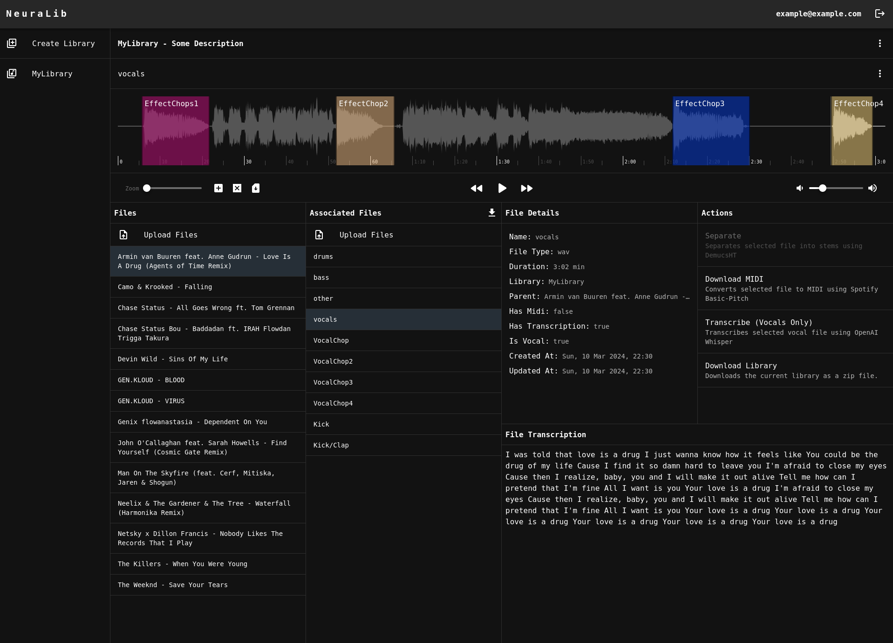

# NeuraLib - Intelligent Sample Management and Processing

## What is it?

- **NeuraLib** is a distributed sample management and processing platform
- Leverages multiple state-of-the-art neural networks for audio processing
  - Source Separation (extract vocals, bass, drums and other using [Demucs](https://github.com/adefossez/demucs))
  - Vocal Transcription (using [OpenAI Whisper](https://github.com/openai/whisper))
  - Audio to Midi conversion (convert audio to midi, for further use in your DAW with [Basic-Pitch](https://github.com/spotify/basic-pitch))
- Audio file library management (build up your library with music, stems and samples, then easily export it for further use)
- Sample slicing (slice extracted stems further into individual samples e.g. drum hits, vocal chops, synth hits etc.)
- Streamed playback (stream large audio files without needing to download the whole file)
- Built in a scalable way using task-queues and workers

## Why does it exist?

For music professionals, audio engineers and hobbyist:

- Sampling has been a big part in music production for decades
- To explore and deconstruct musical pieces
  - Remix tracks easily by separating music into its individual parts
  - Expand your sample library by slicing stems further into samples
  - Understand the meaning of a song by transcribing vocals
- A central place for managing music and samples

For developers:

- A playground for all things audio
  - web-audio
  - music information retrieval tasks
  - neural networks for audio
  - neural networks deployment / usage in an actual application
  - distributed systems dealing with audio processing
- Offer easy to extend platform for experimentation with neural networks
  - create an endpoint, a task queue and a worker to easily add additional processing tasks
- Learn to deal with long-running tasks
- Experiment with [Server-Sent Events](https://developer.mozilla.org/en-US/docs/Web/API/Server-sent_events/Using_server-sent_events)

## Features

- Music / Sample Collection
  - Per user music/sample management
  - Upload/Download music
  - Manage uploaded library, extracted stems and samples
  - Export library or invidivual samples for local usage, e.g. DAW
  - Stream audio, extracted stems and samples directly from object storage
- Sample Slicing
  - Users can slice extracted stems further into individual samples (drum hits, vocal chops, synth hits etc.)
  - Samples are automatically added to library and attached to parent audio
- Source Separation
  - Separate uploaded music into individual stems (vocals, drums, bass, other)
  - Separation is done asynchronously
  - Using [Demucs v4](https://github.com/adefossez/demucs)
- Audio to Midi Conversion
  - Convert any audio file to midi
  - Conversion is done asynchronously
  - Using [Basic Pitch](https://github.com/spotify/basic-pitch) (Spotify)
- Audio to Text (Vocals)
  - Extract lyrics / text from vocals
  - Extraction is done asynchronously
  - Using [OpenAI Whisper](https://github.com/openai/whisper) or one of the several other open-source models

## System Components and Architecture

- [Architecture and Data Flow](./ARCHITECTURE.md)
- [Web-Client](frontend/README.md)
- [Backend](backend/README.md)

  - [API-Gateway](backend/api-gateway/README.md)
  - [Separation Worker](backend/separation-worker/README.md)
  - [Audio To Midi Worker](backend/audio-to-midi-worker/README.md)
  - [Transcription Worker](backend/transcription-worker/README.md)

## How to get started

Check out the [USAGE](./USAGE.md) section for everything you need to get started.

## Update History

As this isn't really a product ready for use there are no official changelogs. See [commit history](https://github.com/p-hlp/distributed-source-separation/commits).

## Links

- Demo Video TBD.
